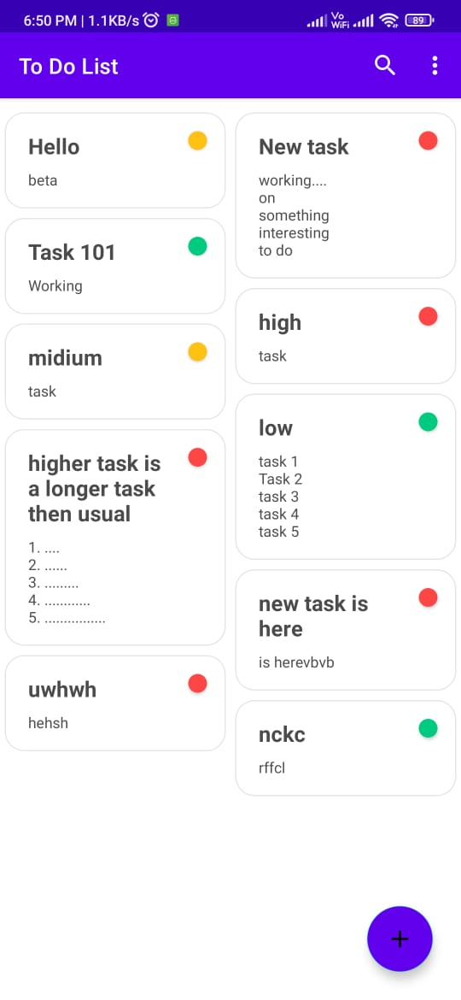
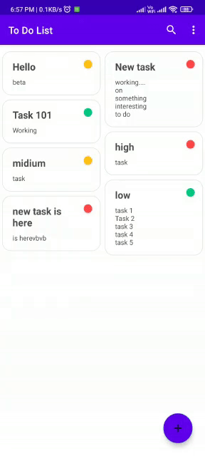
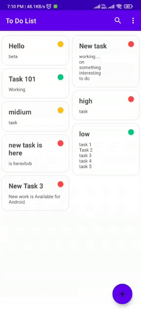

# TO DO APP

**To Do App** is a sample of Task Schedular 🍲 Android application 📱 built to demonstrate use of Modern Android development tools. Dedicated to all Android Developers with ❤️.

***You can Install and test latest Foodium app from below 👇***

## About
It simply work on Room Database with Modern Android development tools.
- This makes it offline capable 😃. 
- Clean and Simple Material UI.
## Built With 🛠
- [Kotlin](https://kotlinlang.org/) - First class and official programming language for Android development.
- [Coroutines](https://kotlinlang.org/docs/reference/coroutines-overview.html) - For asynchronous and more..
- [Android Architecture Components](https://developer.android.com/topic/libraries/architecture) - Collection of libraries that help you design robust, testable, and maintainable apps.
  - [LiveData](https://developer.android.com/topic/libraries/architecture/livedata) - Data objects that notify views when the underlying database changes.
  - [ViewModel](https://developer.android.com/topic/libraries/architecture/viewmodel) - Stores UI-related data that isn't destroyed on UI changes. 
  - [ViewBinding](https://developer.android.com/topic/libraries/view-binding) - Generates a binding class for each XML layout file present in that module and allows you to more easily write code that interacts with views.
  - [Room](https://developer.android.com/topic/libraries/architecture/room) - SQLite object mapping library.
  - [Material Components for Android](https://github.com/material-components/material-components-android) - Modular and customizable Material Design UI components for Android.
  - [Navigation Component]()
  
## Screenshots[Loght Mode]📱
**Home Screen**📱

**Add Screen**📱

**Update Screen**📱

